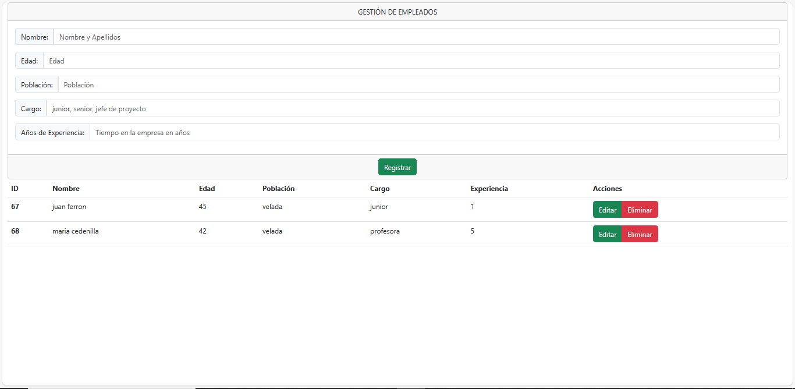

# CRUDconReact-Node
Creo un CRUD con REACT.JS en el Fronted y  NODE el el Backend
Usando Express, axios y SQL como base de datos.
Se trata de crear, editar, actualizar y borrar empleados.
Uso de BOOTSTRAP y SWEETALERT2 para darle estilos.

